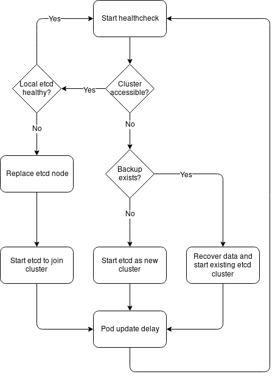

### Overview

_"I want [etcd-operator](https://github.com/coreos/etcd-operator) like management for an etcd cluster, but without the dependecy on Kubernetes, which in turn depends on another etcd cluster"_

This is intended for managing a static on-prem etcd cluster bootstrapped with fixed peer and client URLs. Nodes are expected to come back on the same IP address if rebooted.

Each member node should be running (masterless) Kubelet with a `--pod-manifest-path` configured. Etcd-wrapper will write a static pod manifest for etcd to this path to start and update the etcd instance on the node.

There is no cleanup of etcd data on recovery steps which require removing old data. Data is intended to live in the etcd container and be discarded on pod restart.

### Workflow

- If no cluster exists, recover or start new etcd cluster.
  - Check backup location (S3), and attempt to recover.
  - If backup exists, recover existing cluster.
  - If backup can't be accessed, start new cluster.
  
- If a cluster exists but a member missing, start a new member to join the existing cluster.
  - Start a new etcd instance as an existing member.
  - If a conflicting old member is found in the cluster, remove it using etcd API.
  - Add missing member using etcd API.
  


- Periodic snapshot sent to S3 bucket.

### Sample etcd-wrapper deployed as a static pod

https://github.com/randomcoww/terraform-infra/blob/master/modules/template/kubernetes/templates/ignition_controller/controller.yaml#L182

### Image build

```
mkdir -p build
export TMPDIR=$(pwd)/build

VERSION=latest

podman build \
  -f Dockerfile \
  -t ghcr.io/randomcoww/etcd-wrapper:$VERSION
```

```
podman push ghcr.io/randomcoww/etcd-wrapper:$VERSION
```